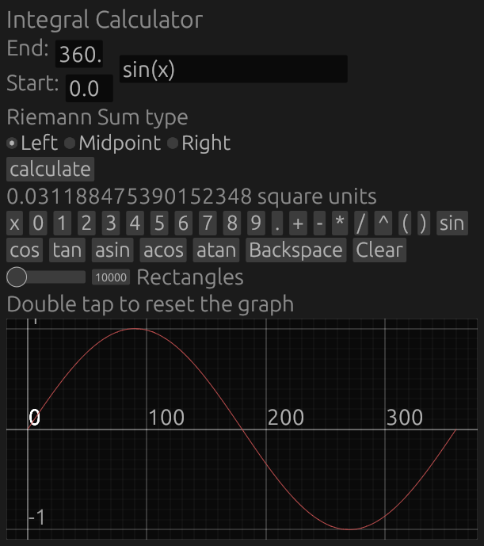

<h1>Integral Calculator</h1>

<h2>Running the binary</h2>

Click on the releases page on the right-hand side and download the release for your platform.

<h3>For Windows or Linux:</h3>

Double click the downloaded binary to run it. You may need to use <code>chmod +x</code> on it

<h3>For Web (server admins)</h3>

Unzip the tarball with <code>tar -xf</code> into the root of your webhosting directory. Open <code>index.html</code> to view it.

<h3>For Android</h3>

Open your downloads folder and tap on the .apk file. If you get a permission error, go into your settings and look
    for something like "permissions" and "install from unknown sources" (Actual names vary between devices). Enable
    this permission for your file manager or downloads viewer.

<h2>Building from source</h2>
<h3>Native version</h3>
<ol>
    <li>Clone this repository with <code>git clone _______________</code> and <code>cd</code> into it</li>
    <li>Download Rust <a href="https://www.rust-lang.org/tools/install">for your platform</a></li>
    <li>Compile with <code>cargo build --release</code></li>
    <li>Your finished binary will appear in <code>target/release/</code></li>
</ol>
<h3>Web version</h3>
<ol>
    <li>Complete steps 1 and 2 of the native version</li>
    <li>Install <code>trunk</code> with <code>cargo install trunk</code></li>
    <li>Build the binary using <code>trunk build --release</code></li>
    <li>Move the files from <code>dist</code> to the root of your webhosting directory</li>
</ol>
<h3>Android version (not tested)</h3>
<ol>
    <li>Complete steps 1 through 3 of the web version</li>
    <li>Run <code>cd pwa</code></li>
    <li>Install <a href="https://developer.android.com/studio/">Android Studio</a> for your platform</li>
    <li>Run android studio. Inside it, navigate to toold -> SDK manager -> SDK Tools and install version 30.0.3</li>
    <li>On Linux, you may need to set an environmental variable to something like <code>export ANDROID_SDK_ROOT=/home/[INSERT USERNAME HERE]/Android/Sdk</code></li>
    <li>Install <a href="https://gradle.org/install/">gradle</a></li>
    <li>On Linux, you may need to append gradle to your PATH with something like <code>export PATH=/usr/local/gradle/bin:$PATH</code></li>
    <li>Install <a href="https://nodejs.org/en/download/">npm</a> for your platform (if your distro packages npm in
        its repos, that version is preferred)</li>
    <li>Install cordova with <code>sudo npm install -g cordova</code></li>
    <li>Install project dependencies with <code>npm install</code></li>
    <li>Add files required for android with <code>cordova platform add android</code></li>
    <li>Copy all files from the web version's /dist to /pwa/www</li>
    <li>Build with <code>cordova build</code></li>
    <li>Your finished APK will appear as <code>pwa/platforms/android/app/build/outputs/apk/debug/app-debug.apk</code></li>
</ol>
